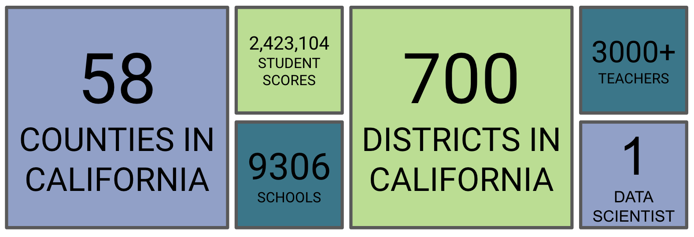
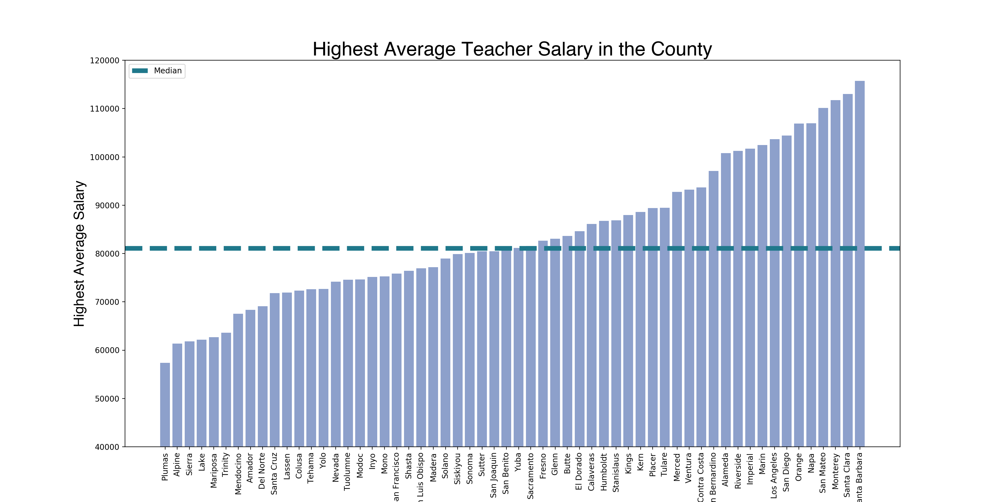
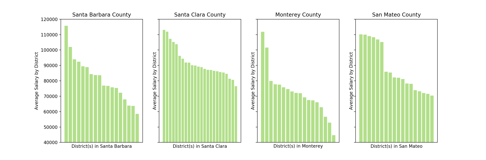
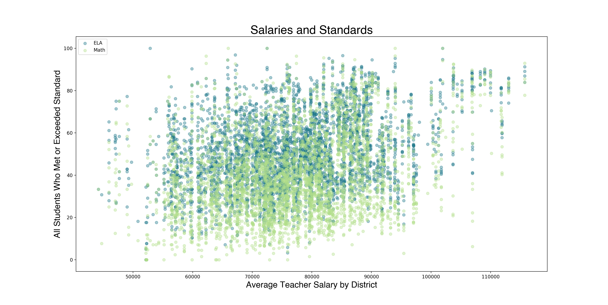
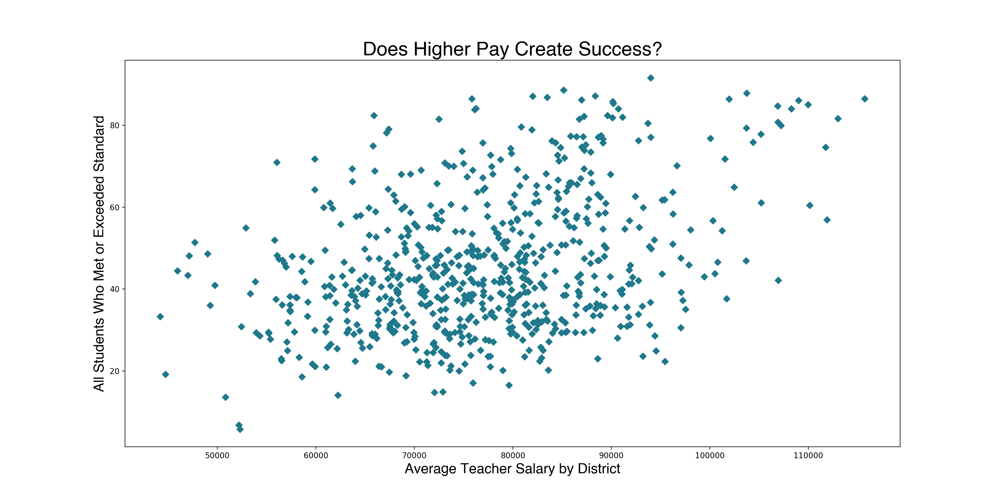
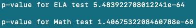
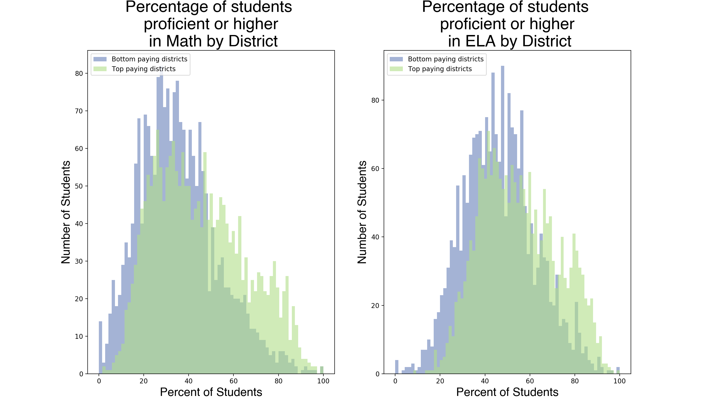
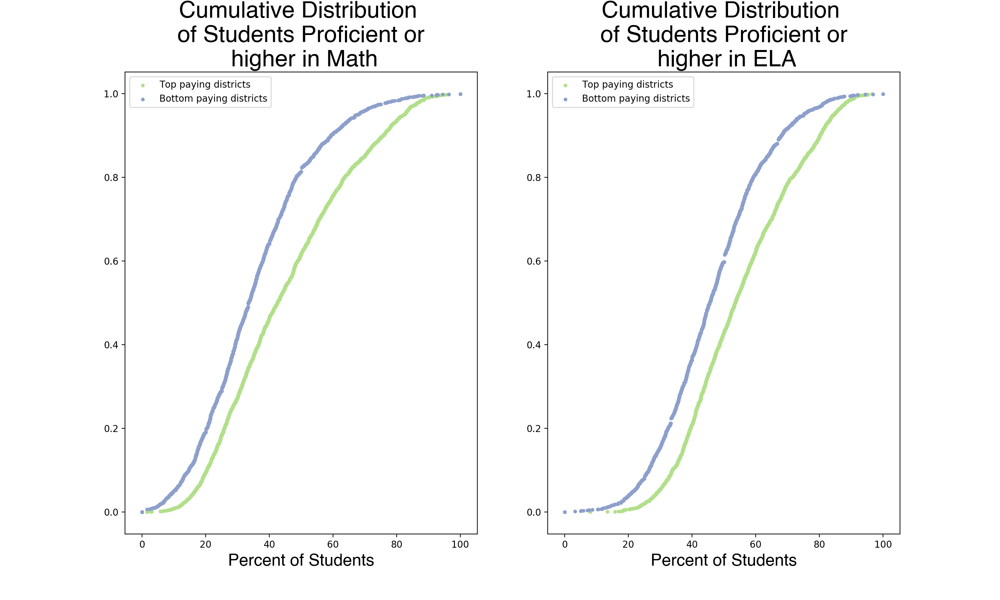

# Salaries and Standards

***Do students from top paying districts score the same as students who attend lower paying Districts?***

**Questions to Explore**
- Do districts with higher salary have higher test scores?
- Which County in California has the highest average teacher salary?
- Which County in California has the highest percentage of students meeting or exceeding standards?

**Data Sources** 
1. Data set on all Smarter Balanced (SBAC) scores of students in both ELA and Math for the State of California in the school year 2018 - 19 
- This large CSV file with over 2 million rows and over 30 columns such as: District code, School code, Grade, Percentage Standard Met, Percentage Standard Nearly Met, Area proficiency, etc.
2. Text file identifying the codes used in SBAC data to identify County, District, and School by name
- This file identifies the County, Distict, and School Names with their specific code in the SBAC file
3. Data set on teacher salary by Districts in the state of California
- This file contains teacher salary data reports aggregated data on the lowest, average, and highest reported salary for each District in California

**Important Things to Know**
- Counties ---> Districts --> Schools
- Students in grade 3 - 8 and 11 will take both the ELA and Math SBAC (Smarter Balanced Assessment Consortium)

**Data Exploration**

- We will begin by looking at the money. 700 District salaries is a lot of for one bar chart, so lets look at each District in each County and find the highest average salary offered in that County. You'll find the median salary running across the middle of the graph so we can see which Counties fall above or below that line.

- There is a large difference between the top 4 Counties and the bottom 4 Counties. Let's take a closer look at those specific Counites and their respective Districts.

- We can clearly see a large difference in average salary by those Counties. Now let's at a look at each District's average teacher salary vs the percentage of students who met or exceeded standard in that same District.

- The above graph is alot - in fact, it is over 8,000 dots since we were looking at every school for both ELA and Math. Let's group each School together by their District and look at them individually and see how that District's average salary compares to the percentage of students who met or exceeded standard for the whole District. 

**Hypothesis Testing**

- After examining the graphs above we can see that as we move along the x-axis the scores do increase, but to better understand the correlation we'll take a look at some correlation heat maps.

- This tells us that yes there is a correlation between salary and test scores.

- Great! Now that we have our student scores seperated out by ELA and Math let's get to our main question. **Do students from top paying Districts score the same or better than students who attend lower paying Districts?**

- Let's seperate out the top paying Districts from the bottom paying Districts see how their students perform on both ELA and Math tests. When we seperate by median salary we have fairly equal data frames of about 2100 Schools in each, let's run a t-test with the standard alpha level of 0.05 to test our null hypothesis that was created prior to seeing any of this data.

*Null Hypothesis: Students from top paying Districts score the same as students from lower paying Districts.*

*Alternate Hypothesis: Students from top paying Districts score better than students from lower paying Districts.*

- When we perform the t-test with scipy.stats for our ELA scores we get a p value 5.484 e-64. WOW! That is significantly less than our alpha level which tells us we can reject our null hypothesis and accept the alternate.

- The results of our t-test with scipy-stats for our Math score is a little different, we receive a p-value of 1.4068 e-60. Another significat number, telling us we can reject our null hypothesis and accept the alternate.

*Students from top paying Districts DO score better than students from lower paying Districts.* 

- Let's visualize the spread of top paying Districts and bottom paying Districts by each subject test.

- Let's look at just one more graph to really hit this idea home. The cumulative distribution function (CDF) of each test comparing the top and bottom paying Districts. 

- Okay one last graph, saved the best for last! We can visualize the map of California and closely compare each County.

**Conclusion**
- Yes, we want our students to be able to read, write and perserver though difficult math problems. It has been shown above that there is a lot of work that needs to be done to ensure our students are meeting standards for their grade level. 
- We also need to ensure that adults are entering the educational career field. Teacher should feel respected and appreciated for the hard work that it takes to do their job. 
- It has been shown that students from higher paying Districts perform better, so let's increase teacher salary!

- Those top paying Districts most likely offer a larger variety of instruction (like music, art, and specialized classes), on campus clubs, and spend money on building their campus community and culture. All of which we know can help support the whole child.

- Teachers make a difference, and the positive ways they can impact our lives go beyond test scores.