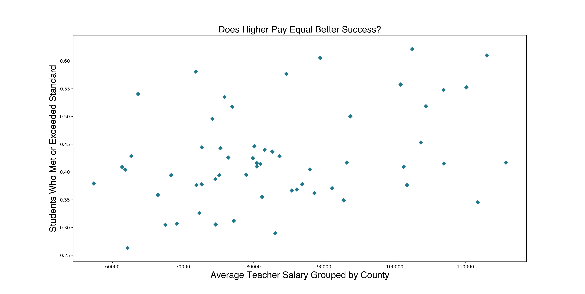

# Capstone 1

**Topic:** 
2019 statewide testing results and teacher salary for California

**High-level description:** 
- Explore statewide testing results from 2019 for students in grades 3 - 11 and teacher salary in California. My wondering is if there is a relationship between teacher salary and the percentage of students who score proficient or higher.

**Data sources:** 
- Three data sets all taken from California Department of Education
    1. Data set on all Smarter Balanced scores of students in both ELA and Math for the State of California
    2. Text file identifying the codes used in SBAC data to identify County, District, and School by name
    3. Data set on teacher salary by Districts in the state of California

**Data description:** 
- State testing data is in a large CSV file with over 2 million rows and about 30 columns such as: District code, School code, Grade, Percentage Standard Exceeded, Percentage Standard Met, Percentage Standard Nealy Met, Percentage Standard Not Met
- There is an additional District and School CSV that identifies the County, Distict, and School Names with their specific code in the SBAC file
- Teacher salary data reports the lowest, average, and highest reported salary by district in California

**Common Terms**
- Let's discuss come common terms that will be used throughout the remainder of this README
- There are 58 Counties in California with over 900 Districts. Each District has their own number of schools and serving anywhere from 596,937 (Los Angeles Unified) to 4 students (Panoche Elementary)
- Students in grade 3 - 8 and 11 will take both the ELA and Math SBAC (Smarter Balanced Assessment Consortium)
- Students with special needs will take a modified version, and are not accounted for in this analysis

**Data Exploration**
- The highest average salary offered in that County

- Lets look at the average teacher salary vs the percentage of students who met or exceeded standard

- The above graph is alot! In fact, it is over 8,000 dots. Let's think about that - every County in California has sometimes hundreds of districts, and every district has multiple schools, then every school has two tests for all students in grade 3 - 8 and 11th grade. 

- Lets look at the WHOLE county and highlight the highest average salary for that county (no one wants over aggregated data), and see how that compares to the percentage of students who met or exceeded standard for the WHOLE county
