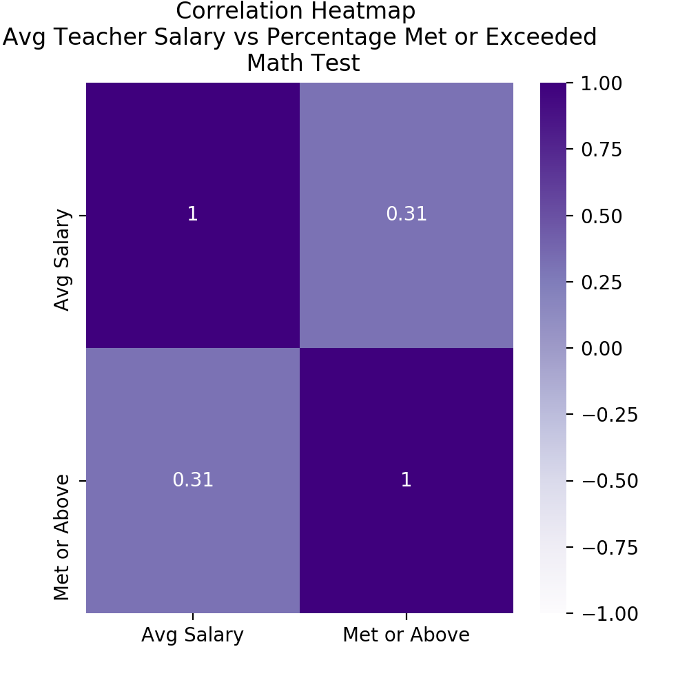
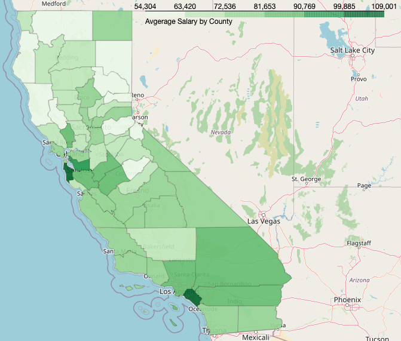
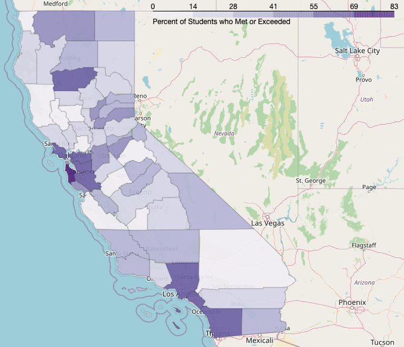

# Capstone 1

**Topic:** 
2019 statewide testing results and teacher salary for California

**Questions to explore:** 
- Do districts with higher salary have higher test scores?
- Which county in California has the highest average teacher salary?
- Which county in California have the highest percentage of students meeting or exceeding standards?

**Data sources:** 
- Three data sets were taken from California Department of Education
    1. Data set on all Smarter Balanced (SBAC) scores of students in both ELA and Math for the State of California
    2. Text file identifying the codes used in SBAC data to identify County, District, and School by name
    3. Data set on teacher salary by Districts in the state of California

**Data description:** 
- State testing data is in a large CSV file with over 2 million rows and over 30 columns such as: District code, School code, Grade, Percentage Standard Exceeded, Percentage Standard Met, Percentage Standard Nealy Met, Percentage Standard Not Met
- There is an additional District and School CSV that identifies the County, Distict, and School Names with their specific code in the SBAC file
- Teacher salary data reports the lowest, average, and highest reported salary by district in California

**Common Terms**
- There are 58 Counties in California with over 900 Districts. Each District has their own number of schools and serve anywhere between 596,937 (Los Angeles Unified) to 4 students (Panoche Elementary)
- Students in grade 3 - 8 and 11 will take both the ELA and Math SBAC (Smarter Balanced Assessment Consortium)
- Students with special needs will take a modified version, and are not accounted for in this analysis

**Data Exploration**
- Since we do not want to over aggregate our data, so lets look at each District in each County and find the highest average salary offered in that County

- We can look at each district's average teacher salary vs the percentage of students who met or exceeded standard in that same district

- The above graph is alot - in fact, it is over 8,000 dots! Lets look at each District individually and see how that District's average salary compares to the percentage of students who met or exceeded standard for the whole county

- ttest results
*image 

- Lets seperate out the top paying districts from the bottom paying districts by splitting them at the Median and see how their students perform on both ELA and Math tests

- Lets look at difference between the top half paying districts and the bottom half paying districts CDF for both ELA and Maths

  

